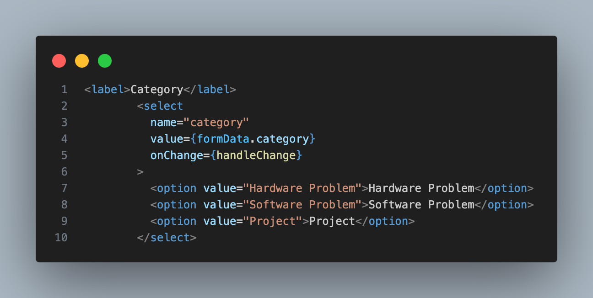
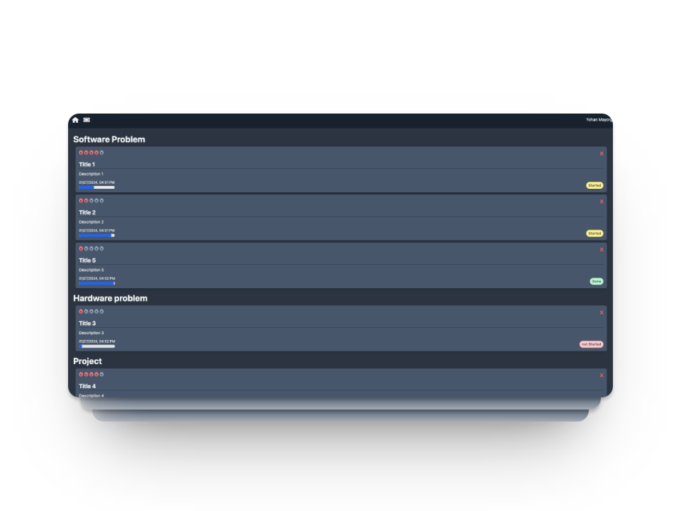
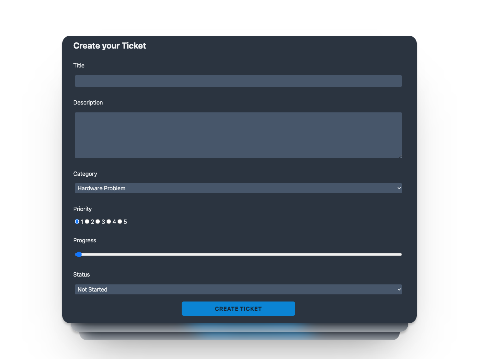
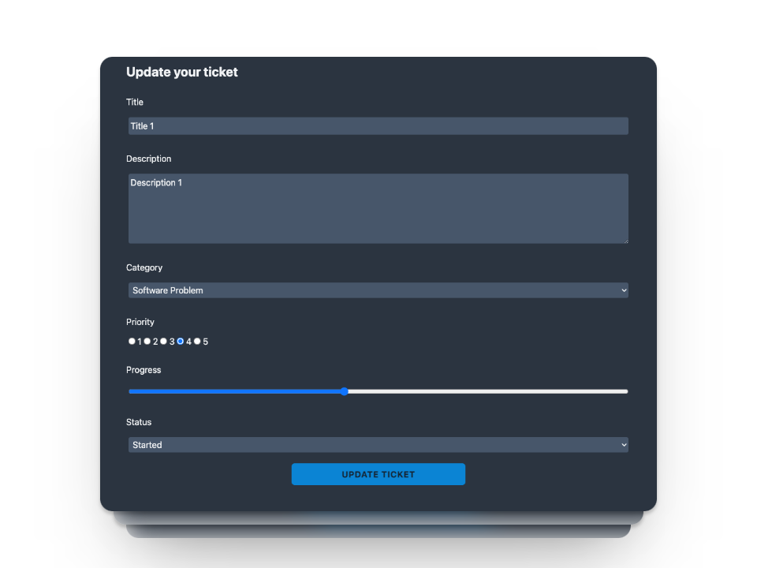

# Ticket App

Full stack web application project based on a simple application that allows you to create, modify or delete tickets with relevant information, which can be used for study, work or personal projects.



## Used tools

```bash
HTML, CSS, JavaScript, NextJS, MongoDB, API, Tailwind.
```

## How does it work?

At the top of the page you will find the tickets to go to Home and to create a new ticket. When you press the second button, this page opens that allows you to enter the data corresponding to the new ticket.


After creating the new ticket, when you return to Home, you will be able to see all the tickets you have created, with their respective details. Tickets are automatically saved in the database. Each ticket has the option to delete it, which not only removes it from the user interface, but also from the database.


The information corresponding to each ticket can be modified by clicking on the corresponding ticket. A window will open with the ticket information, and it can be updated in the database.


## Learn More

This open source project is completely free to use, download and customize.

## Deploy on Vercel

The website is available at the [link.](https://ticketsapp-sigma.vercel.app/)
